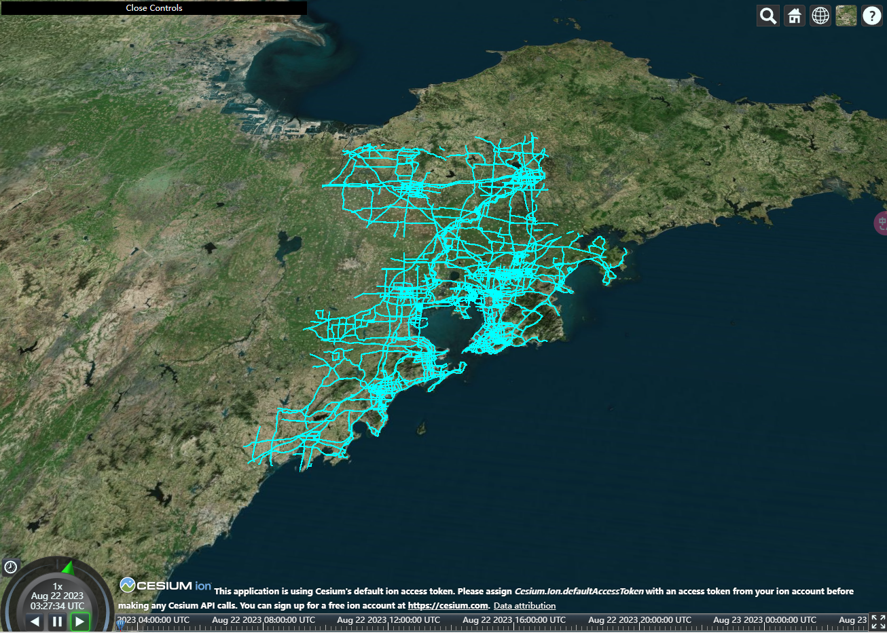

# Cesium.js 中如何自定义 Material？

> 本文描述了如何在 Cesium.js 自定义一个 Material，并展示效果。
>
> - [查看地址](https://cesium-road-image-flow-material.vercel.app/)
> - [仓库地址](https://github.com/WaterSeeding/CesiumRoadImageFlowMaterial)

<br />

## 介绍


在 Cesium.js 中，Material（材质）用于定义 3D 对象的外观效果：
它用于设置几何体的颜色、透明度、纹理贴图等属性，从而实现各种视觉效果。

### 参数介绍

| 参数                | 类型                       | 默认值                            | 描述                                                             |
| ------------------- | -------------------------- | --------------------------------- | ---------------------------------------------------------------- |
| strict              | boolean                    | false                             | 抛出通常会被忽略的问题的错误，包括未使用 uniforms 或者 materials |
| translucent         | (boolean / function)       | false                             | 半透明设置                                                       |
| minificationFilter  | TextureMinificationFilter  | TextureMinificationFilter.LINEAR  | TextureMinificationFilter 应用于材质的纹理                       |
| magnificationFilter | TextureMagnificationFilter | TextureMagnificationFilter.LINEAR | TextureMagnificationFilter 应用于该材质的纹理                    |
| fabric              | object                     |                                   | 用于生成材质的 fabric JSON                                       |

<br />

## 思路

### 1.加载路线资源链接，获取路线地理数据

```tsx
const { features } = res;
const instance: any = [];
if (features?.length) {
  features.forEach((item: any) => {
    const coordinates = item.geometry.coordinates;
    coordinates.forEach((subCoordinates: number[][]) => {
      let posCoordinates: number[] = [];
      subCoordinates.forEach((coordinate: number[]) => {
        posCoordinates = posCoordinates.concat(coordinate);
      });
      const polyline = new Cesium.PolylineGeometry({
        positions: Cesium.Cartesian3.fromDegreesArray(posCoordinates),
        width: 1.7,
        vertexFormat: Cesium.PolylineMaterialAppearance.VERTEX_FORMAT,
      });
      const geometry = Cesium.PolylineGeometry.createGeometry(polyline);
      instance.push(
        new Cesium.GeometryInstance({
          geometry: geometry!,
        })
      );
    });
  });
}
```

<br />

### 2.添加 Material 材质内容

- 设置 primitive 的几何实体（GeometryInstance）
- 设置 primitive 的外观（Appearance）
- 设置 primitive 的材质（Material）

这里的 Material 材质，是通过`Cesium.Material`的`fromType`来改变材质的`uniforms`，创建新的`color`颜色材质。

```tsx
const appearance = new Cesium.PolylineMaterialAppearance({
  material: Cesium.Material.fromType("Color", {
    color: new Cesium.Color(0.0, 1.0, 1.0, 1.0),
  }),
});
const primitive = new Cesium.Primitive({
  geometryInstances: instance,
  appearance: appearance,
  asynchronous: false,
});
```

如图所示：


<br />

### 3.自定义 Material 材质内容


```tsx
const material = new Cesium.Material({
  strict: false,
  translucent: function () {
    return true;
  },
  minificationFilter: Cesium.TextureMinificationFilter.LINEAR,
  magnificationFilter: Cesium.TextureMagnificationFilter.LINEAR,
  fabric: {
    uniforms: {
      image: image,
      speed: 10,
    },
    source: RoadImageFlowMaterialSource,
  },
});
```

如上图和代码所示：

> 这里的`Cesium.Material`关键是在`fabric`，其他属性都是默认值。
>
> 在 Cesium.js 的 Material 中，`fabric`是一种特殊的材质类型，它通过将纹理映射到几何体表面来实现视觉效果。（纹理可以是 Image、Canvas）
> 通过将自定义的图像、图案或其他可视元素应用到几何体上，实现更多样化的外观效果。

1. 通过`fabric.uniforms`对象来指定材质 image、speed 常量
2. 设置`fabric.source`属性设置 shader 效果

<br />

### 4.fabric.source 的 Shader 效果

```glsl
czm_material czm_getMaterial(czm_materialInput materialInput) {
  czm_material material = czm_getDefaultMaterial(materialInput);
  vec2 st = materialInput.st;
  vec4 colorImage = texture(image, vec2(fract((st.s - speed * czm_frameNumber * 0.001)), st.t));
  material.alpha = colorImage.a;
  material.diffuse = colorImage.rgb * 1.5 ;
  return material;
}
```

> - czm_material: 材质信息（通过函数 czm_getMaterial 返回）。
> - czm_materialInput: 函数 czm_getMaterial 的输入内容（UV 面）。
> - czm_getDefaultMaterial: （具有默认值的 czm_material）每个材质的 czm_getMaterial 都应使用此默认材质作为其返回材质的基础。
> - czm_frameNumber: （一个自动 GLSL uniform 表示时间戳帧数）这种 uniform 每帧都会自动递增。
> - texture: 从纹理中检索纹素（texels）


1. 通过czm_getDefaultMaterial函数将材质参数materialInput，转化为czm_material材质
2. 将材质参数materialInput赋值给st变量
3. 然后，使用GLSL texture获取image图片的图像数据
4. 最后将image图片的图像数据赋值给czm_material材质的alpha、diffuse，输出

<br />

## 相关资料

- [Cesium](https://cesium.com/)
- [Cesium Documentation](https://cesium.com/docs/)
